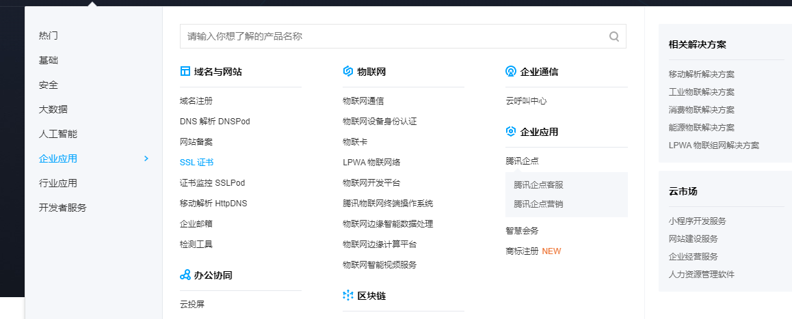

现在很多网站都由原来的http://www.xxx.com转换为https://www.xxx.com,这就是说从http协议，转到了https协议。如果说现在不是https协议的话，chrome浏览器会给我们一个不安全的提示。https协议比http协议安全性高，对于一些表单的提交都是加密的，当我们在表单中输入一些敏感信息时，降低了数据泄露的可能性。

下面我们介绍我们自己建设的网页，如何实现https。采用的技术是springboot+腾讯云ssl+阿里云服务器。如果ssl和云服务器是同一个公司买的，比如都是在阿里云买的，那么配置会很简单，而如果不是在同一个公司买的，可能就比较复杂了。

首先我们介绍如何申请一个免费的ssl证书，至于如何实现，我们在下一篇文章中讲解。腾讯云提供免费的1年ssl证书下载，不打广告。（因为他是免费的，打广告最起码让你花钱吧。）

下面说一下申请免费ssl证书的过程。

1.打开地址https://cloud.tencent.com/，在企业应用中找到ssl证书。

2.点击选购。

3.选择免费ssl证书。

4.填写信息

5.填写手动验证dns，点击确认申请。（得证明这个域名是你的吧）

6.批准成功后会给上面那个邮箱发邮件。

7.打开那个地址。

8.我们复制一下记录值、记录类型、主机记录等信息。打开阿里云的域名解析控制台，添加一条记录。

9.如果配置正确，我们就可以收到下面的邮件了。

​	10、点击链接查看。

到这儿，我们就申请到了一个免费的腾讯云ssl证书。我们把颁发的证书下载下来就可以使用了，至于如何使用，我们在下一篇文章中讲解。