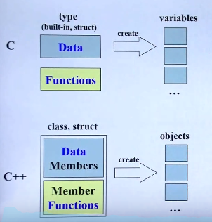
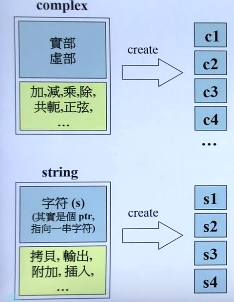
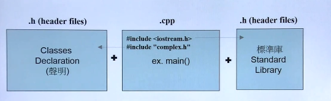
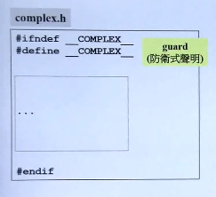
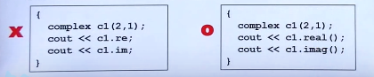
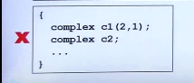
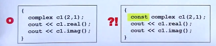
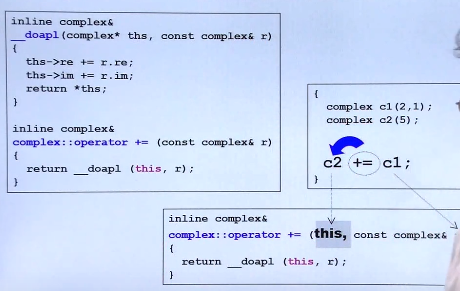

一、C++编程简介

#### 1.应该懂得知识

1. 某种过程化语言（C语言最好）

   变量

   类型

   作用域

   循环

   流程控制

2. 编译、连接有关知识

3. 如何进行编译、连接(如何建立一个可运行的程序)

#### 2.我们的目标

1.培养正规的、大气的编程习惯

2.以良好的方式编写C++ class
class without pointer members 

Complex
class with pointer members

String

3.学习Classes之间的关系


单一class：基于对象的

多个class有关联：面向对象

#### 3.你将获得的代码

complex.h
complex-test.cpp

string.h
string-test.cpp

#### 4.C++的历史

• B 語言 (1969)
• C 語言 (1972)
• C++ 語言 (1983)
(new C -> C with Class -> C++)
• Java 語言
• C# 語言

#### 5.C++演化

•C++ 98 (1.0)
• C++ 03 (TR1, Technical Report 1)
• C++ 11 (2.0)
• C++ 14

C++ 包含：C++语言和C++标准库

###### 书籍

C++primer

The C++ programming language

EffectiveC++（有中文译本）

The C++ standard library

STL源码剖析

## 二、头文件与类的声明

#### 1.C VS C ++



C++把数据和对数据的操作包装在一起

数据有多份，函数只有一份



complex中直接存放着数据

string这个类中其实只有一个指针

如何创建了四个字符串，那么他们的大小是一样的，都是一个指针的长度

类比：complex中有黄金，而string中有藏宝图

#### 2.面向对象，基于对象

Object Based : 面對的是單一 class 的設計
Object Oriented : 面對的是多重 classes 的設計，classes 和 classes 之間的關係。

#### 3.C++程序的基本形式



#### 4.output

C++程序

```c++
#include <iostream.h>
using namespace std;
int main()
{
    int i = 7;
    cout << “i=“ << i << endl;
    return 0;
}
```

C程序

```c++
#include <stdio.h>
int main()
{
    int i = 7;
    printf(“i=%d \n”, i);
    return 0;
}
```

#### 5.防卫式声明

防卫式声明:防止代码以后重复使用的使用



complex-test.h

```c++
#include <iostream>
#include "complex.h"

using namespace std;

ostream& operator << (ostream& os, const complex& x)
{
  return os << '(' << real (x) << ',' << imag (x) << ')';
}

int main()
{
  complex c1(2, 1);
  complex c2(4, 0);

  cout << c1 << endl;
  cout << c2 << endl;
  
  cout << c1+c2 << endl;
  cout << c1-c2 << endl;
  cout << c1*c2 << endl;
  cout << c1 / 2 << endl;
  
  cout << conj(c1) << endl;
  cout << norm(c1) << endl;
  cout << polar(10,4) << endl;
  
  cout << (c1 += c2) << endl;
  
  cout << (c1 == c2) << endl;
  cout << (c1 != c2) << endl;
  cout << +c2 << endl;
  cout << -c2 << endl;
  
  cout << (c2 - 2) << endl;
  cout << (5 + c2) << endl;
  
  return 0;
}
```

#### 6.头文件的布局

```c++
#ifndef _COMPLEX_
#define _COMPLEX_


//前置声明
#inlucde  <cmath>
class ostream;
class complex;
complex& _doapl (complex* ths,const complex& r);

//类声明
class complex
{
    ...
};

//类定义
complex::function ...
    
#endif
```

#### 7. class的声明

```c++
class complex
{
public:
    complex(double r=0,double i=0):re(r),im(i){}
    complex& operator += (const complex&);
    double real () const{return re;}
    double img() const{return im;}
private:
    double re,im;
    friend complex& _doapl (complex*,const complex&);  
};


{
    complex c1(2,1);
    complex c2;
    ...
}
```

#### 8. class template 简介

```c++
template <typename T>
class complex
{
public:
    complex (T r = 0,T i = 0):re(r),im(i){}
    complex& operator += (const complex&);
    T real () const{return re;}
    T img() const{return im;}
private:
    T re,im;
    friend complex& _doapl (complex*,const complex&);
}

{
    complex<double> c1(2.5,1.5);
    complex<int> c2(2,6);
}
```

## 三、构造函数

#### 1. inline函数

函数若在class内部完成，则函数变为inline候选人（不一定会变为inline）

#### 2.访问级别

```c++
class complex
{
public://可以有好几段public和private，不一定所有的public放在一起
    complex(double r=0,double i=0):re(r),im(i){}
    complex& operator += (const complex&);
    double real () const{return re;}
    double img() const{return im;}
private:
    double re,im;
    friend complex& _doapl (complex*,const complex&);  
};

inline double imag(const complex& a)
{
    return x.imag();
}
```

读取书记的方式：



#### 3.构造函数

```c++
complex(double r=0,double i=0):re(r),im(i){}
//创建对象的三种方法
{
    complex c1(2,1);
    complex c2;
    complex* c3 = new complex(4);
}
```

1)名字和类名字一样，创建对向时自动调用

2)可以有参数

3)参数可以有默认值

初始化的两种方式，两种方式一样的意义，但是初始列的方式速度要快一点

```c++
//初始化
complex(double r=0,double i=0):re(r),im(i){}
//赋值，这种方式效率稍微差一些
complex(double r=0,double i=0)
{
    re=r;
    im=i;
}
```

#### 4.构造函数可以有很多个-------重载

同名函数可以有多个，当参数不同的时候其实编译器会把函数编成不同的名字

?real@Complex@@QBENXZ
?real@Complex@@QAENABN@Z

```c++
//这样的情况不能同时存在
complex(double r=0,double i=0):re(0),im(0){}
complex():re(0),im(0){}
{
    complex c1();
    complex c2;
}
```

#### 5.把构造函数放在private区域

如果这么做，那么就不能直接通过构造函数创建一个对象。

```c++
//singleton  单例模式
class A 
{
public:
	static A& getInstance();
	setup() { ... }
private:
	A();
	A(const A& rhs);
	...
};

A& A::getInstance()
{
	static A a;
	return a;
}
```




#### 6.const 常量成员函数

```c++
class complex
{
public:
    complex(double r=0,double i=0):re(r),im(i){}
    complex& operator += (const complex&);
    double real () const{return re;}//const函数：不会改变数据内容
    double img() const{return im;}//const写前面与写后面是不一样的
private:
    double re,im;
    friend complex& _doapl (complex*,const complex&);
};

//const函数：不会改变数据内容
```

```c++
{
    const complex c1(2,1);//这个对象的内容是不变的
    cout<<c1.real();//如何double real () const{return re;}中的const掉了，则会报错
    cout<<c1.imag();
}
```



> const 可能出现在函数体的前面，这个代表函数不会改变变量的值，也可能出现在对象的前面，表示对象或者变量一定是不可以改的。如果对象前面加了const，函数的前面也一定要有const否则会报错。

#### 7.参数传递:pass by value   pass by reference

```c++
class complex
{
public:
	complex (double r = 0, double i = 0) : re (r), im (i){ }//这样是传值
	complex& operator += (const complex&);//这样是传引用
	double real () const { return re; }
	double imag () const { return im; }
private:
	double re, im;
	friend complex& __doapl (complex*, const complex&);
};

ostream& operator << (ostream& os, const complex& x)//也有可能没有const，仅仅是传引用
{
return os << '(' << real (x) << ','<< imag (x) << ')';
//reference和指针不同
尽量少传值
```

如果说只想传值让对方使用，而不想让对方改值，那么就可以加上const

#### 8.返回值传递，by value by reference

```c++
complex (double r = 0, double i = 0) : re (r), im (i){ }//这样是返回值
complex& operator += (const complex&);//这样是返回引用
```

#### 9.友元

```c++
class complex {
public:
    complex (double r = 0, double i = 0) : re (r), im (i) { }
    complex& operator += (const complex&);
    double real () const { return re; }
    double imag () const { return im; }
private:
    double re, im;
    friend complex& __doapl (complex*, const complex&);
};

//声明再complex类中，朋友可以来这个类中直接拿数据
inline complex& __doapl (complex* ths, const complex& r) 
{
	ths->re += r.re;
    ths->im += r.im;
    return *ths;
}
```

#### 10.相同class的各个object互为友元

```c++
class complex
{
public:
	complex (double r = 0, double i = 0): re (r), im (i){ }
	int func(const complex& param){ return param.re + param.im; }
private:
	double re, im;
};
//同一个妈生的，东西可以互相用
{
    complex c1(2,1);
    complex c2;
    c2.func(c1);
}
```

#### 10.classbody外的各种定义

> 什么情况下可以pass by reference
>
> 什么情况下可以return by reference

```c++
inline complex&
__doapl(complex* ths, const complex& r) 
{
	ths->re += r.re;//第一参数将会会改动，第二参数不会被改动
    ths->im += r.im;
    return *ths;
}
inline complex&
    complex::operator += (const complex& r) 
{
    return __doapl(this, r);
}
//在一个函数中处理完了数据，放在局部变量中，当我们进行返回的时候不可以传递reference，
//返回完成中这个东西就会消失，传递的引用会失去作用
```

## 五、操作符重载与临时对象

#### 1.操作符重载-1    成员函数  this



```c++
//所有的成员函数都有this，可能是隐藏的，this不可以显示的写出来
inline complex&
complex::operator += (this, const complex& r)//这里的this是为了理解才写出来的，其实不能写出来
{
	return __doapl (this, r);
}
```

```c++
inline complex&
    __doapl(complex* ths, const complex& r)
{
	ths->re += r.re;
	ths->im += r.im;
	return *ths;
}
//提取一个函数是为了可能再次使用
inline complex&
    complex::operator += (const complex& r)
{
	return __doapl (this, r);
}
//为什么在函数前面加两个下划线？
```

#### 2.return by reference 语法分析

note：传递者无需知道接收者是以reference形式接收


```c++
inline complex&
__doapl(complex* ths, const complex& r)
{
	...
	return *ths;//往回传递是值，而接收者是引用
}
inline complex&//返回值类型不可以是void的原因：c3+=c2+=c1会报错
complex::operator += (const complex& r)
{
	return __doapl(this,r);
}


complex::function ...//类函数
```

```c++
inline double
imag(const complex& x)
{
	return x.imag ();
}
inline double
real(const complex& x)
{
	return x.real ();
}

{
    complex c1(2,1);
    cout << imag(c1);
    cout << real(c1);
}

```

#### 3.操作符重载-2    无成员函数  无this

```c++
inline complex
operator + (const complex& x, const complex& y)
{
	return complex (real (x) + real (y),
	imag (x) + imag (y));
}
inline complex
operator + (const complex& x, double y)
{
	return complex (real (x) + y, imag (x));
}
inline complex
operator + (double x, const complex& y)
{
	return complex (x + real (y), imag (y));
}
```

#### 4.临时对象

下面这些函数绝对不可以return referce，因为他们返回的必定是个local object

```c++
inline complex
operator + (const complex& x, const complex& y)
{
    return complex (real (x) + real (y),
    imag (x) + imag (y));
}
inline complex
operator + (const complex& x, double y)
{
	return complex (real (x) + y, imag (x));
}
inline complex
operator + (double x, const complex& y)
{
	return complex (x + real (y), imag (y));
}


{
    int(7);
    complex c1(2,1);
    complex c2;
    complex();//运行完就死掉
    complex(4,5);//运行完就死掉
    cout << complex(2);
}
```

#### 5.操作符重载-非成员函数

```c++
inline complex
conj (const complex& x)
{
	return complex (real (x), -imag (x));
}
#include <iostream.h>
ostream&
operator << (ostream& os, const complex& x)//定义全局的<<
{
    //这个地方如果os是const类型的，那么将会报错
	return os << '(' << real (x) << ','<< imag (x) << ')';
}

{
    complex c1(2,1);
    cout << conj(c1);//这样的话可以没有返回值
    cout << c1 << conj(c1);//连串的使用必须有返回值才可以
}

```

1.初始列的使用

2.函数该不该加const

3.参数尽量pass by reference，pass的时候该不该加const

## 六、复习complex类的使用

1.防卫式函数定义

2.数据私有

3.函数一般公用

4.函数是否加const


仔细考虑参数如何传，返回值如何传

## 七、三大函数：拷贝构造、拷贝复制、析构

#### 1.string class (并不是标准库中的class)

```c++
#ifndef __MYSTRING__
#define __MYSTRING__

class String
{
    ...
}

String::function(...){...}
Global-function(...){...}

#endif

int main()
{
    String s1;
    String s2("hello");
    
    String s3(s1);
    cout<<s3<<endl;
    s3=s2;
    cout<<s3<<endl;
}
```

#### 2.Big Three ,三个特殊函数

```c++
class String
{
public:
    String(const char* cstr = 0);
    String(const String& str);//拷贝构造
    String& operator=(const String& str);//拷贝赋值
    ~String();//析构函数
    char* get_c_str() const {return m_data;} 
private:
    char* m_data;
};
```

#### 3.构造函数和析构函数

```c++
inline String::String(const char* cstr=0)
{
    if(cstr){
        m_data = new char[strlen(cstr)+1];
        strcpy(m_data, cstr);
    }
    else{
        m_data = new char[1];
        *m_data = '\0';
    }
}
inline String::~String()
{
    delete[] m_data;
}


{
    String s1();
    String s2("Hello");
    
    String* p = new String("hello");
    delete p;
}
```

#### 4.class with pointer members必须有copy ctor  和copy op=

```c++
String a("Hello");
String b("World");//在内存中他们各自有一份


//使用default copy ctror或default op=就会形成以下局面
b=a;//他们公用一份   这样会造成内存泄漏
//alias别名的意思
//浅层复制与深层复制
```

#### 5.copy ctor拷贝构造函数

```c++
inline
String::String(const String7 str)
{
    m_data = new char[strlen(str.m_data)+1];
    strcpy(m_data, str.m_data);//直接取另一个对象的数据，兄弟之间互为友元函数
}


{
    String s1("hello");
    String s2(s1);
//    String s2 = s1;
}
```

#### 6.copy assignment operator拷贝赋值函数

```c++
inline String& String::operator=(const String& str)
{
    if(this == &str)
        return *this;//检测自我赋值
    delete[] m_data;
    m_data = new char[strlen(str.m_data)+1];
    strcpy(m_data, str.m_data);
    return *this;
}
```

#### 7.一定要在operator=中检查是否self assignment

```c++
	delete[] m_data;//如果不检查，会把自己给杀掉
    m_data = new char[strlen(str.m_data)+1];
    strcpy(m_data, str.m_data);//然后拷贝出错
```

## 八、栈、堆、内存管理

#### 1.output函数

```c++
#include<iostream>
ostream& operator(ostream& os, const String&)//放在后面引用，放在前面取地址
{
    os<<str.get_c_str();
    return os;
}

{
    String s1("hello");
    cout<<s1;
}
```

#### 2.栈与堆

Stack，是存在於某作用域 (scope) 的一塊內存空間 (memory space)。例如當你調用函數，函數本身即 會形成一個 stack 用來放置它所接收的參數，以及返 回地址。
在函數本體 (function body) 內聲明的任何變量， 其所使用的內存塊都取自上述 stack。

Heap，或謂 system heap，是指由操作系統提供的 一塊 global 內存空間，程序可動態分配 (dynamic allocated) 從某中獲得若干區塊 (blocks)。 

当数据是栈中分配的话，作用域结束内存会自动回收，当数据是从堆中自己申请的话那么我们在作用域结束的时候就要把他杀死，归还给内存。

```c++
class Complex { … }; 
... 
{ 
    Complex c1(1,2); 
    Complex* p = new Complex(3);
}
```

#### 3.stack objects 的生命期

```c++
class Complex { ... };
...
{
Complex c1(1,2);
}
```

c1 便是所謂 stack object，其生命在作用域 (scope) 結束之際結束。
這種作用域內的 object，又稱為 auto object，因為它會被「自動」清理

#### 4.static local objects 的生命期

```c++
class Complex { … };
...
{
	static Complex c2(1,2);
}
```

c2 便是所謂 static object，其生命在作用域 (scope)結束之後仍然存在，直到整個程序結束。

#### 5.global objects 的生命期

```c++
class Complex { … };
...
Complex c3(1,2);
int main()
{
	...
}

```

c3 便是所謂 global object，其生命在整個程序結束之後
才結束。你也可以把它視為一種 static object，其作用域
是「整個程序」。

#### 6.heap objects 的生命期

```c++
class Complex { … };
...
{
Complex* p = new Complex;
...
delete p;
}
```

P 所指的便是 heap object，其生命
在它被 deleted 之際結束。

```c++
class Complex { … };
...
{
Complex* p = new Complex;//指针死亡但是内存没有被释放，所以会造成内存泄漏
}
```

以上出現內存洩漏 (memory leak)，
因為當作用域結束，p 所指的 heap
object 仍然存在，但指針 p 的生命卻
結束了，作用域之外再也看不到 p
(也就沒機會 delete p）

#### 7.new：先分配memory，再调用ctor

```c++
String* ps = new String("Hello");
//编译器会将上面这句话转换为下面的
void* mem = operator new( sizeof(String) ); //分配內存   其內部調用 malloc(n)
ps = static_cast<String*>(mem); //轉型
ps->String::String("Hello"); //構造函數     String::String(ps,"Hello");
```

1.开辟内存

2.转型

3.构造函数

#### 8.delete：先调用dtor，再释放内存

```c++
String* ps = new String("Hello");
...
delete ps;

String::~String(ps); // 析構函數
operator delete(ps); // 釋放內存    其內部調用 free(ps)
```

#### 9.动态分配所得的内存块   in vc

分配的内存块是16的倍数

cookie中最后一位是表示借出没有

#### 10.动态分配的数组

没听懂

#### 11.array new 一定要搭配array delete

```c++
String* p = new String[3];
...
delete[] p; //喚起3次dtor

String* p = new String[3];
...
delete p; //喚起1次dtor
```

## 九、类模板、函数模板、其它

#### 1.static

在数据或者函数前面加上static，那么它就成为静态的

同样的类创建的对象，函数只有一份

静态函数只能处理静态数据

```c++
complex c1,c2,c3;//每个非静态数据都创建一遍，加了static的数据脱离对象
cout<<c1.real();//静态函数也只有一份，没有this这个pointer
cout<<c2.real();
```


```c++
class Account {
public:
static double m_rate;
static void set_rate(const double& x) { m_rate = x; }
};
double Account::m_rate = 8.0;//静态数据要写这么一行
int main() {
Account::set_rate(5.0);
Account a;
a.set_rate(7.0);
//調用 static 函數的方式有二：
//(1) 通過 object 調用
//(2) 通過 class name 調用
```

#### 2.把ctor放在private区

```c++
class A 
{
public:
	static A& getInstance();
	setup() { ... }
private:
	A();
	A(const A& rhs);
	...
};
A& A::getInstance()
{
	static A a;//只有当函数调用它，它才会出现
	return a;
}
```

#### 3.cout

```c++
class ostream : virtual public ios
{
public:
ostream& operator<<(char c);
ostream& operator<<(unsigned char c) { return (*this) << (char)c; }
ostream& operator<<(signed char c) { return (*this) << (char)c; }
ostream& operator<<(const char *s);
ostream& operator<<(const unsigned char *s)
{ return (*this) << (const char*)s; }
ostream& operator<<(const signed char *s)
{ return (*this) << (const char*)s; }
ostream& operator<<(const void *p);
ostream& operator<<(int n);
ostream& operator<<(unsigned int n);
ostream& operator<<(long n);
ostream& operator<<(unsigned long n);
...
}

class _IO_ostream_withassign
: public ostream {
...
};
extern _IO_ostream_withassign cout;
```

#### 3.class template

```c++
template<typename T>
class complex
{
public:
	complex (T r = 0, T i = 0) : re (r), im (i){ }
    complex& operator += (const complex&);
    T real () const { return re; }
    T imag () const { return im; }
    private:
    T re, im;
    friend complex& __doapl (complex*, const complex&);
};

{
    complex<double> c1(2.5,1.5);//这样使用即可
    complex<int> c2(2,6);
    ...
        模板会造成代码膨胀
}
```

#### 4.function template

```c++
class stone
{
public:
    stone(int w, int h, int we): _w(w), _h(h), _weight(we){ }
    bool operator< (const stone& rhs) const{ return _weight < rhs._weight; }
private:
	int _w, _h, _weight;
};

stone r1(2,3), r2(3,3), r3;
r3 = min(r1, r2);

template <class T>
inline
const T& min(const T& a, const T& b)
{
	return b < a ? b : a;//已经对<进行了重载
}
```

#### 5.namespace

```c++
//using directive
using namespace std;

//using declaration
using std::cout;

//using 
std::cout<<a;
```

#### 6.更多细节深入

```c++
operator type() const;
explicit complex(…) : initialization list { }
pointer-like object
function-like object
Namespace
template specialization
Standard Library
variadic template (since C++11)
move ctor (since C++11)
Rvalue reference (since C++11)
auto (since C++11)
lambda (since C++11)
range-base for loop (since C++11)
unordered containers (Since C++)
```

## 十一、组合与继承

#### 1.复合  composition--has a

某个类中含有其他的类做成员

```c++
template <class T, class Sequence = deque<T> >
class queue {
...
protected:
    //这里用到了复合
    Sequence c; // 底層容器
public:
    // 以下完全利用 c 的操作函數完成
    bool empty() const { return c.empty(); }
    size_type size() const { return c.size(); }
    reference front() { return c.front(); }
    reference back() { return c.back(); }
    // deque 是兩端可進出，queue 是末端進前端出（先進先出）
    void push(const value_type& x) { c.push_back(x); }
    void pop() { c.pop_front(); }
};
```


```c++
template <class T>
class queue {
	...
protected:
	deque<T> c; // 底層容器
public:
    // 以下完全利用 c 的操作函數完成
    bool empty() const { return c.empty(); }
    size_type size() const { return c.size(); }
    reference front() { return c.front(); }
    reference back() { return c.back(); }
    //
    void push(const value_type& x) { c.push_back(x); }
    void pop() { c.pop_front(); }
};
```

#### 2.复合关系下的构造与析构

构造由内而外：(建的时候先建里面)

container的构造函数首先调用component的default构造函数，然后再执行自己。

```c++
Container::Container Container::Container((……): ): Component() Component() { { …… };};
```

析构由外而内：（拆的时候先拆外面，不然抽掉里面外面就塌了）

container的析构函数首先执行自己，然后才调用component的析构函数。

```c++
Container::~Container Container::~Container((……){ ){ …… ~Component() ~Component() };
```

#### 3.委托delegation

```c++
// file String.hpp
class StringRep;
class String {
public:
    String();
    String(const char* s);
    String(const String& s);
    String &operator=(const String& s);
    ~String();
    . . . .
private:
	StringRep* rep; // pimpl   pointer to impletation 
    //我拥有这个指针，在需要的时间就可以调用这个指针，所以叫做delegation
    //拥有的是指针就是delegation
};
```

```c++
// file String.cpp
#include "String.hpp"
namespace {
class StringRep {
friend class String;
StringRep(const char* s);
~StringRep();
int count;
char* rep;
};
}
String::String(){ ... }
...
```

#### 4.继承-is-a

```c++
struct _List_node_base//struct也是类
{
    _List_node_base* _M_next;
    _List_node_base* _M_prev;
};
template<typename _Tp>
struct _List_node : public _List_node_base//继承这么写
{
	_Tp _M_data;
};
//父类的数据是可以被继承下来的
```

#### 5.继承关系下构造和析构

derived object 派生对象

父类对象是子类对象的一部分

**構造由內而外：**

```c++
Derived::Derived Derived::Derived((……): ): Base() Base() { { …… };
```

Derived 的構造函數首先調用 Base 的 default 構造函數，然後才執行自己。

**析構由外而內:**

```c++
Derived::~Derived Derived::~Derived((……){ ){ …… ~Base() ~Base() };};
```

Derived 的析構函數首先執行自己，然後才調用 Base 的析構函數。


**base class 的 dtor必須是 virtual，否則會出現undefined behavior**

## 十二、虚函数与多态

#### 1.Inheritance (繼承) with virtual functions (虛函數) 

non-virtual 函数：你不希望 derived class 重新定義 (override, 覆寫) 它

只有当虚函数重新定义后才能叫override，其它情况下不能叫做重写

virtual 函數：你希望 derived class 重新定義 (override, 覆寫) 它，且你對它已有默认定義。
pure virtual 函數：你希望 derived class 一定要重新定義 (override 覆寫)它，你對它沒有默認定義。

```C++
//函数继承继承的是函数的调用权
class Shape 
{
public:
	virtual void draw( ) const = 0;//纯虚函数
	virtual void error(const std::string& msg); 
	int objectID( ) const;//非虚函数
	...
};
class Rectangle: public Shape { ... };
class Ellipse: public Shape { ... };
```

#### 2.Template Method

#### 3. 继承

```c++
01 #include <iostream>
02 using namespace std;
03
04
05 class CDocument
06 {
07 public:
08 void OnFileOpen()
09 {
10 // 這是個算法，每個 cout 輸出代表一個實際動作
11 cout << "dialog..." << endl;
12 cout << "check file status..." << endl;
13 cout << "open file..." << endl;
14 Serialize();
15 cout << "close file..." << endl;
16 cout << "update all views..." << endl;
17 }
18
19 virtual void Serialize() { };
20 };

22 class CMyDoc : public CDocument
23 {
24 public:
25 virtual void Serialize()
26 {
27 // 只有应用程序本身才知道如何读取自己的文件(格式)
28 cout << "CMyDoc::Serialize()" << endl;
29 }
30 };

31 int main()
32 {
33 CMyDoc myDoc; // 假設對應[File/Open]
34 myDoc.OnFileOpen();
35 }
```

#### 4.继承+复合关系下的构造和析构

子类继承，子类中还有复合，到底是继承优先还是复合优先？

> 構造由內而外:
>
> Derived 的構造函數首先調用 Base 的 default 構造函數，
> 然後調用 Component 的 default 構造函數，
> 然後才執行自己。
>
> 析構由外而內:
>
> Derived 的析構函數首先執行自己，
> 然後調用 Component 的 析構函數，
> 然後調用 Base 的析構函數。

子类继承，**父类中有复合**，到底是继承优先还是复合优先？   先component-》再父类-》最后子类

#### 5.委托+继承

```c++
class Subject
{
    int m_value;
    vector<Observer*> m_views;
public:
    void attach(Observer* obs)
    {
        m_views.push_back(obs);
    }
    void set_val(int value)
    {
        m_value = value;
        notify();
    }
    void notify()
    {
        for (int i = 0; i < m_views.size(); ++i)
            m_views[i]->update(this, m_value);
    }
};


class Observer
{
public:
virtual void update(Subject* sub, int value) = 0;
};
```

## 十三、委托相关设计

#### 1.delegation + inheritance

```c++
class Primitive: public Component
{
public:
	Primitive(int val): Component(val) {}
};

class Component
{
	int value;
public:
    Component(int val) { value = val; }
    virtual void add( Component* ) { }
};


class Composite: public Component
{
	vector <Component*> c;
public:
    Composite(int val): Component(val) { }
    void add(Component* elem) {
    	c.push_back(elem);
	}
	…
};
```

prototype设计模式：

 父类是原型，下面的实现要挂载到上面

```c++
#include <iostream.h>
enum imageType
{
LSAT, SPOT
};
class Image
{
public:
virtual void draw() = 0;
static Image *findAndClone(imageType);
protected:
virtual imageType returnType() = 0;
virtual Image *clone() = 0;
// As each subclass of Image is declared, it registers its prototype
static void addPrototype(Image *image)
{
_prototypes[_nextSlot++] = image;
}
private:
// addPrototype() saves each registered prototype here
static Image *_prototypes[10];
static int _nextSlot;
};
Image *Image::_prototypes[];
int Image::_nextSlot;
```

```cpp
class LandSatImage: public Image
{
public:
imageType returnType() {
return LSAT;
}
void draw() {
cout << "LandSatImage::draw " << _id << endl;
}
// When clone() is called, call the one-argument ctor with a dummy arg
Image *clone() {
return new LandSatImage(1);
}
protected:
// This is only called from clone()
LandSatImage(int dummy) {
_id = _count++;
}
private:
// Mechanism for initializing an Image subclass - this causes the
// default ctor to be called, which registers the subclass's prototype
static LandSatImage _landSatImage;
// This is only called when the private static data member is inited
LandSatImage() {
addPrototype(this);
}
// Nominal "state" per instance mechanism
int _id;
static int _count;
};
// Register the subclass's prototype
LandSatImage LandSatImage::_landSatImage;
// Initialize the "state" per instance mechanism
int LandSatImage::_count = 1;


class SpotImage: public Image
{
public:
imageType returnType() {
return SPOT;
}
void draw() {
cout << "SpotImage::draw " << _id << endl;
}
Image *clone() {
return new SpotImage(1);
}
protected:
SpotImage(int dummy) {
_id = _count++;
}
private:
SpotImage() {
addPrototype(this);
}
static SpotImage _spotImage;
int _id;
static int _count;
};
SpotImage SpotImage::_spotImage;
int SpotImage::_count = 1;
```

