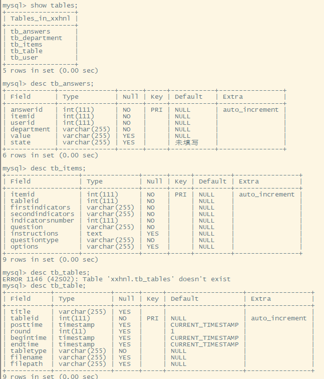

有如下的表结构



三张表之间的关系，首先有一个问卷表（tb_tables），然后有一个题目表（tb_items），然后用户填写之后会存在（tb_answers）中，现在的需求是要删除某张问卷

（1）     给定一个问卷的id,然后在tb_answers中查找用户是不是填了这样表

```sql
select count(*) from tb_answers where tb_answers.itemid in (select tb_items.itemid from tb_table,tb_items where tb_table.tableid=tb_items.tableid and tb_table.tableid=#{tableid});
```

（1）     给定一个id，删除某个问卷，删除三部分数据：

​		1） tb_tables

​		2） tb_items(tableid字段匹配上面的tableid)

​		3） tb_answers(itemid字段匹配上方tb_items表中的itemid字段的数据)

```sql
delete from tb_table where tableid='id'

delete from tb_answers where itemid=(select itemid from tb_items where tableid='id')

delete from tb_items where tableid='id'
```


>其实你的题目思考思考也不难啦。第一题，问卷表的问卷id对应的题目表中也存在问卷id（tableid），题目表中itemid也对应着tb_answers的itemid。所以第一题可以联合查询。
>
> 
>
>第二题，实际上，题目的意思就是，当我想要删掉一个问卷的时候，我希望系统里所有跟这个问卷相关的存储都删除，跟问卷相关的有三个表，所以其实是三个表的删除语句。已知tableid，删除问卷表的相关信息时，只需要tableid就可以;删除题目表相关信息需要知道tableid就行;删除tb_answers表相关信息，需要先从题目表中查看tableid对应的是哪个itemid，然后删除tb_answers对应的itemid的相关信息，所以这里注意的是，tb_answers表要先于题目表删除，要是题目表已经删除了，那么tb_answers表删除对应信息时就查询不到了，就删除不了了

